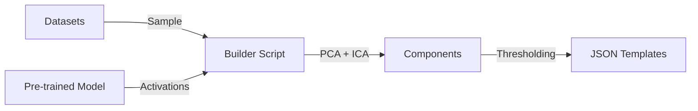
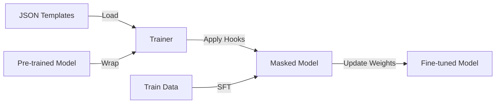

# FunctionalNetworksSFT Context Model

## 1. Project Overview
**FunctionalNetworksSFT** is a library for **Functional Network-Based Selective Fine-Tuning** of Large Language Models (LLMs). It implements a brain-inspired approach to fine-tuning where specific groups of neurons ("functional networks") are identified using **Independent Component Analysis (ICA)** and then selectively trained or frozen.

**Core Hypothesis**: LLMs contain functional networks analogous to those in the human brain. Selectively training these networks can mitigate catastrophic forgetting and improve training efficiency compared to updating all weights.

**Key Features**:
- **ICA-based Network Discovery**: Decomposes neuron activations into functional components.
- **Selective Masking**: Applies binary masks to MLP intermediate layers during forward passes to lesion (remove) or preserve specific networks.
- **Cross-Platform Support**: Optimized for NVIDIA GPUs (CUDA), Apple Silicon (MPS), and CPU.
- **Integration**: Built on top of Hugging Face `transformers`, `peft` (LoRA/QLoRA), and `bitsandbytes`.

## 2. Architecture & Core Components

### 2.1. `ICAMask` (`src/functionalnetworkssft/ica_mask.py`)
The central class for identifying and manipulating functional networks.
- **Functionality**:
    - **Global ICA**: Captures final MLP outputs across all layers and runs FastICA to identify global functional components.
    - **Masking**: Creates binary masks for MLP intermediate neurons based on ICA components.
    - **Hooks**: Registers PyTorch forward hooks to apply masks during model inference/training.
    - **Template Management**: Builds, saves, and loads ICA templates (pre-computed masks).
- **Key Methods**:
    - `compute_global_networks()`: Runs the ICA process.
    - `apply_component_masks()`: Injects hooks to mask neurons.
    - `build_templates_from_current_components()`: Exports current masks as templates.

### 2.2. Training Engine (`src/functionalnetworkssft/fnsft_trainer.py`)
A wrapper around Hugging Face's `Trainer` for SFT with functional network support.
- **Features**:
    - **Model Loading**: Handles quantization (4-bit/8-bit), device mapping, and LoRA adapter setup.
    - **Dataset Processing**: Intelligent chat template detection (`auto`, `chat`, `alpaca`, `chatml`) and pre-tokenization caching.
    - **Integration**: Integrates `ICAMask` to apply functional network masks during training.
    - **Platform Awareness**: Adjusts settings for CUDA vs. MPS (e.g., disabling gradient checkpointing on MPS if unstable).

### 2.3. Template Builder (`src/functionalnetworkssft/build_ica_templates.py`)
A standalone CLI tool to pre-compute ICA templates from datasets.
- **Purpose**: Decouples the expensive ICA analysis from the training loop.
- **Workflow**:
    1. Loads model and datasets.
    2. Samples data and runs forward passes to collect activations.
    3. Performs PCA (for dimensionality reduction) and FastICA.
    4. Saves identified components as JSON templates.

### 2.4. Utilities
- **`model_utils.py`**:
    - `get_optimal_device()`: Auto-detects CUDA, MPS, or CPU.
    - `setup_lora()`: Configures LoRA adapters.
    - `convert_to_gguf()`: Helper for GGUF conversion.
- **`dataset_utils.py`**:
    - `DatasetFormatter`: Heuristics to detect and normalize various dataset formats (Alpaca, ShareGPT, etc.) into a standard `instruction`/`response` format.

## 3. Data Flow & Workflows

### 3.1. ICA Template Generation

### 3.2. Selective Fine-Tuning

## 4. Technical Constraints & Notes
- **ICA Computation**: Can be memory-intensive. The system uses PCA for dimensionality reduction before ICA if the activation matrix is too large.
- **Platform Specifics**:
    - **CUDA**: Supports 4-bit/8-bit quantization (`bitsandbytes`).
    - **MPS (Apple Silicon)**: No quantization support yet. Uses `float16`.
    - **CPU**: Fallback, uses `float32`.
- **Masking Implementation**: Masks are applied as **forward pre-hooks** on the MLP down-projection linear layer. This effectively zeros out specific neurons in the intermediate layer *after* activation.

## 5. Directory Structure
- `src/functionalnetworkssft/`: Source code.
- `scripts/`: Setup scripts (e.g., `setup_cuda.py`).
- `ica_templates/`: Default storage for generated templates.
- `experiments/`: Experimental configurations and logs.
